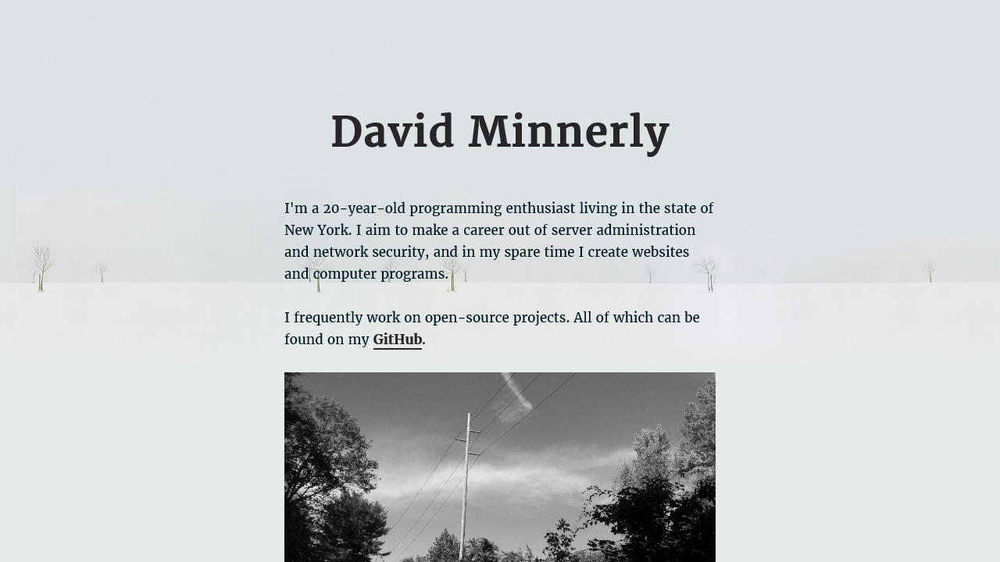

# The Website of David Minnerly

This is the source code for my personal website, [davidminnerly.com](http://davidminnerly.com). It's a simple one-pager that leverages [inuitcss](https://github.com/inuitcss/getting-started), [Webpack](http://webpack.js.org) and numerous other amazing utilities.



## Contributing

Install [Node.js](https://nodejs.org/en/) if you don't have it already. From there you'll need to install all the packages and start the dev server to get going.

```shell
$ npm install
$ npm run serve # Compiles serves the content.
```

With the dev server running, you can start expanding upon the existing content, which can be found at the following locations:

- `src/css/`: Stylesheets, written in Sass. `main.scss` loads in all of the partials in the other folders. Read up on [inuitcss](https://github.com/inuitcss/inuitcss) to understand how everything works.
- `src/img/`: All of the site's images.
- `src/js/`: JavaScript files used in our markup.
- `src/templates/`: [Pug](https://pugjs.org/) layouts and mixins to give the site a consistent look.
- `src/views/`: Pages for the site. This is where the index goes, along with things like an 'about' or 'contact' page.

Happy coding!
